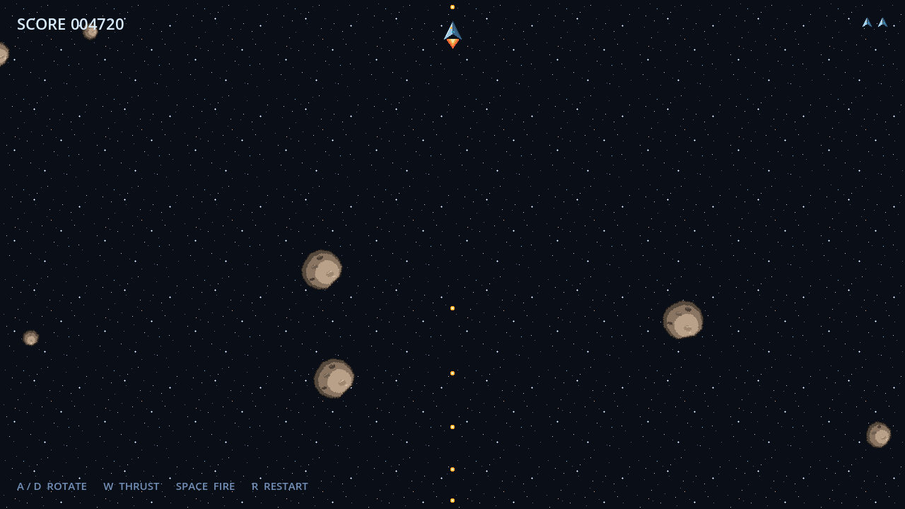

# Asteroids

Klasyczne **Asteroids** napisane w Godot 4 — mały, ale kompletny projekt 2D:
statek z bezwładnością, zawijana (wrap-around) arena, asteroidy dzielące się na
mniejsze odłamki, punktacja, życia i fale przeciwników. Cała grafika to
oryginalny pixel art wykonany lokalnie w Aseprite.



## Wymagania

* **Godot 4.x** (projekt tworzony i weryfikowany na 4.7, `config/features = "4.7"`).
* Brak zewnętrznych zależności, brak sieci, brak telemetrii.

## Jak uruchomić

1. Otwórz katalog projektu w Godot (`Import` → wskaż `project.godot`).
2. Naciśnij **F5** albo uruchom scenę główną `res://scenes/main.tscn`.

Z poziomu terminala, jeśli Godot jest w `PATH`:

```sh
godot --path .
```

## Sterowanie

| Akcja          | Klawisze          |
| -------------- | ----------------- |
| Obrót w lewo   | `A` / `←`         |
| Obrót w prawo  | `D` / `→`         |
| Ciąg (thrust)  | `W` / `↑`         |
| Strzał         | `Spacja`          |
| Restart        | `R`               |

## Zasady gry

* Statek przyspiesza w kierunku dziobu, ma bezwładność, lekkie tłumienie
  prędkości, ograniczenie prędkości maksymalnej i krótki cooldown strzału.
* Statek, pociski i asteroidy zawijają się na krawędziach areny 1280×720.
* Asteroidy występują w trzech rozmiarach. Trafiona duża dzieli się na dwie
  średnie, średnia na dwie małe, mała znika.
* Punktacja: **duża 20**, **średnia 50**, **mała 100** — jak w oryginale
  najmniejsze odłamki są najcenniejsze.
* Pociski mają ograniczony czas życia i same się usuwają, więc chybione
  strzały nie zostawiają śmieci w scenie.
* Zderzenie z asteroidą kosztuje życie. Po respawnie statek jest przez chwilę
  nietykalny (miga). Przy zerze żyć pojawia się ekran **GAME OVER**
  z możliwością restartu.
* Fale są **deterministyczne i ograniczone**: liczba asteroid rośnie od 3 do
  maksymalnie 9, a generator losowy jest seedowany numerem fali, więc ten sam
  numer fali zawsze daje ten sam układ startowy. Asteroidy nigdy nie pojawiają
  się bliżej niż 260 px od statku.

## Architektura

```
project.godot          konfiguracja, mapa wejścia, warstwy kolizji, filtr nearest
scenes/
  main.tscn            scena główna: tło, kontenery Asteroids/Bullets, Player, HUD
  player.tscn          statek + sprite ciągu + kształt kolizji
  asteroid.tscn        pojedyncza asteroida (rozmiar ustawiany w czasie działania)
  bullet.tscn          pocisk
  hud.tscn             warstwa interfejsu
scripts/
  arena.gd             wspólna geometria areny i funkcja zawijania pozycji
  main.gd              menedżer gry: fale, spawnowanie, punkty, życia, restart
  player.gd            sterowanie, fizyka lotu, strzał, nietykalność
  asteroid.gd          rozmiary, ruch, obrót, podział i wartość punktowa
  bullet.gd            lot, czas życia, trafienie w asteroidę
  hud.gd               wynik, ikony żyć, podpowiedzi sterowania, banner
assets/
  aseprite/            edytowalne źródła .aseprite
  sprites/             wyeksportowane PNG (przezroczyste, nearest-neighbour)
docs/                  zrzut ekranu do README (pomijany przez Godota, .gdignore)
```

Zasady, których trzyma się kod:

* **Typowany GDScript** i krótkie, jednoodpowiedzialnościowe skrypty — brak
  jednego wielkiego pliku sterującego wszystkim.
* Komunikacja przez **sygnały** (`Player.fired`, `Player.died`,
  `Asteroid.destroyed`), a nie przez odpytywanie obcych węzłów.
* Asteroidy dopisują się do **grupy** `Arena.ASTEROID_GROUP`, więc warunek
  „fala wyczyszczona” nie zależy od tego, pod jakim rodzicem siedzą; nigdzie
  nie ma bezwzględnych ścieżek w stylu `/root/Main/...`.
* `Arena` to autonomiczny helper ze stałymi areny i funkcją `wrap()`, używany
  przez statek, pociski i asteroidy — jedna definicja zawijania dla wszystkich.
* Warstwy kolizji są nazwane w `project.godot`: `player`, `asteroids`,
  `bullets`; maski są minimalne (asteroidy nie kolidują ze sobą).
* Wszystkie liczniki czasu to zwykłe pola aktualizowane w `_physics_process`,
  bez `await`, dzięki czemu restart nigdy nie ściga się z zaplanowanym timerem.

## Grafika

Cała grafika w `assets/` jest **oryginalna i stworzona lokalnie w Aseprite**
na potrzeby tego repozytorium. Nie użyto żadnych materiałów zewnętrznych,
pobranych ani objętych cudzymi prawami autorskimi. W repozytorium leżą zarówno
źródła `.aseprite` (do dalszej edycji), jak i wyeksportowane PNG:

| Plik              | Rozmiar | Zastosowanie                       |
| ----------------- | ------- | ---------------------------------- |
| `ship`            | 32×32   | statek gracza                      |
| `ship_thrust`     | 16×32   | płomień silnika                    |
| `bullet`          | 8×8     | pocisk                             |
| `asteroid_large`  | 64×64   | duża asteroida                     |
| `asteroid_medium` | 40×40   | średnia asteroida                  |
| `asteroid_small`  | 24×24   | mała asteroida                     |
| `starfield`       | 128×128 | kafelkowe tło z gwiazdami          |
| `life_icon`       | 16×16   | ikona życia w HUD                  |

Projekt renderuje pixel art w trybie **nearest-neighbour**
(`textures/canvas_textures/default_texture_filter=0`), a wszystkie sprite'y
poza tłem mają przezroczystość.

Projekt nie zawiera dźwięku — świadomie, żeby nie wprowadzać materiałów
niewytworzonych lokalnie.

## Opcjonalnie: lokalny dodatek Godot AI

Projekt był rozwijany z pomocą lokalnego dodatku *Godot AI* do inspekcji sceny
i automatycznych testów rozgrywki. Dodatek jest **narzędziem deweloperskim
osoby pracującej nad projektem i nie jest częścią tego repozytorium** — nie ma
go w historii Gita i nie jest potrzebny do uruchomienia gry.

Jeśli chcesz go użyć u siebie, zainstaluj go we własnym katalogu
`addons/`, włącz w `Project → Project Settings → Plugins` i **nie commituj**
ani katalogu dodatku, ani wpisów, które sam dopisuje do `project.godot`
(`[editor_plugins]` oraz autoload `_mcp_game_helper`). Gałąź główna celowo
trzyma `project.godot` wolny od tych wpisów, żeby świeży klon działał bez
dodatku.

## Historia

Repozytorium zaczęło się od pustego szkieletu (w tym testowego pusha
z GitHub Copilot App); ta gałąź wnosi pierwszą grywalną wersję MVP.
